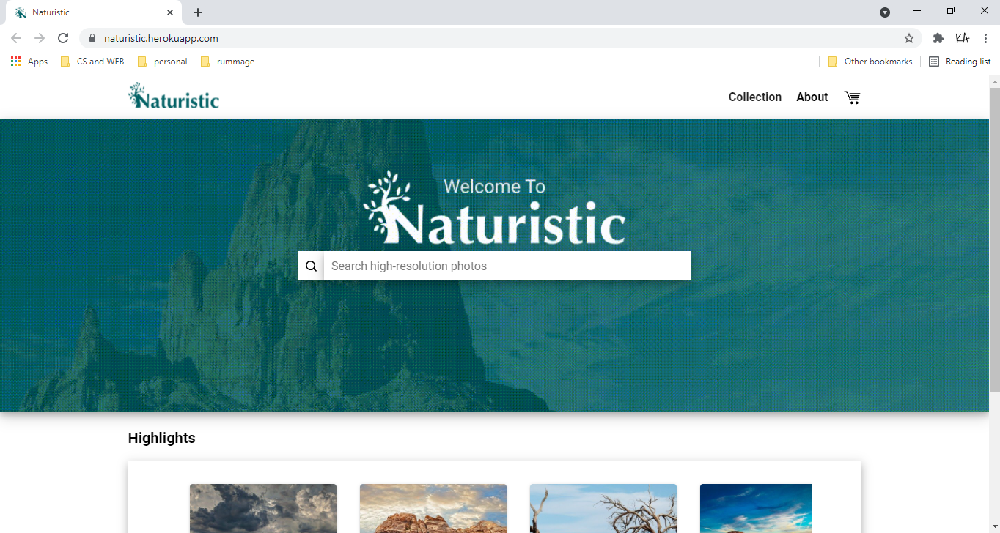

# Naturistic
###### Created by Daniel Urias, Kalicia Ashcraft, and Doug Osborn

This was our Code School 2021 group's final project. We had 3 weeks to build out a web app. We decided to do an online store integrating stripe. It uses Web technologies including HTML, CSS, Javascript, JSON, Vue.js (version 2), Vuetify, Node.js, and Express.js. It implements REST APIs to STRIPE for payment processing. We used GIT-GITHUB-HEROKU for source code control and automated deployment stack. This project was for DEMO purposes only and is integrated with stripe in TEST MODE. The photos were from various photographers from Pixabay and NASA.

